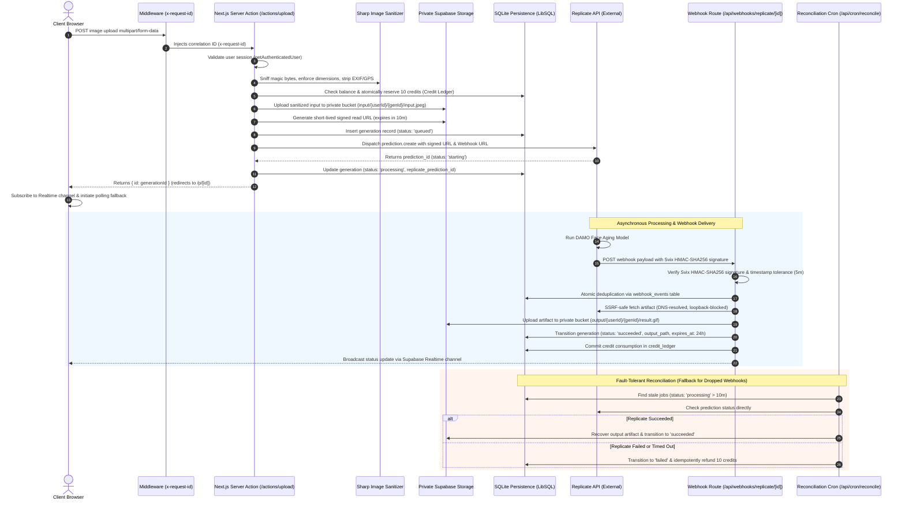
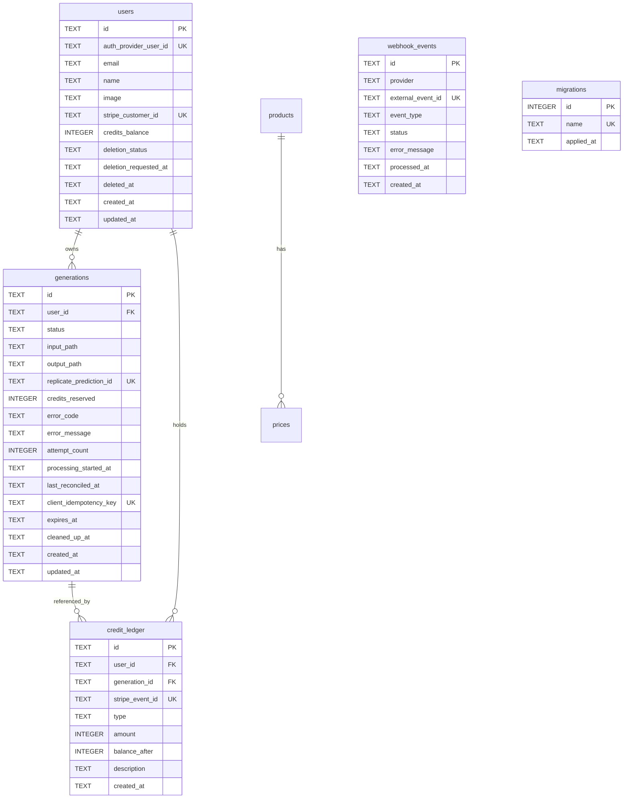
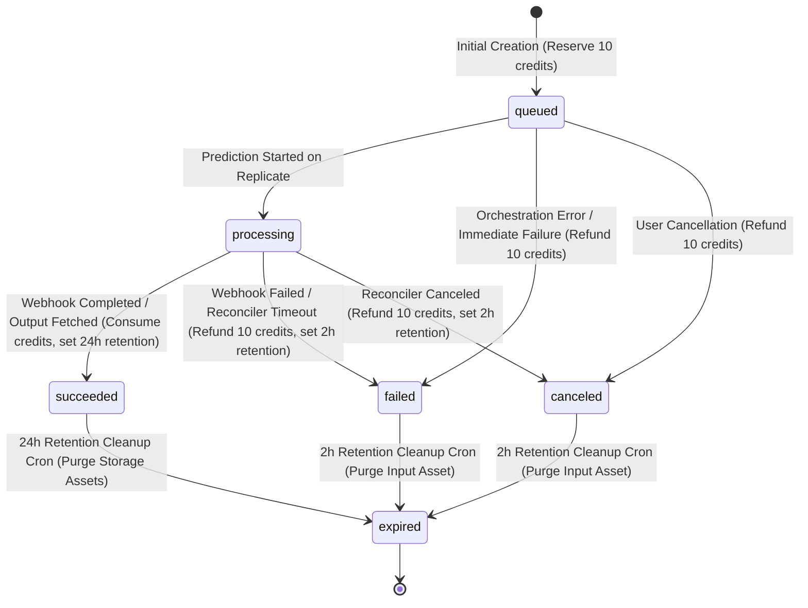

# Extrapolate — Enterprise Engineering & Production Architecture Documentation

> **Production-grade AI age-progression SaaS platform built with Next.js 14 App Router, SQLite via LibSQL, Supabase Auth & Private Storage, Replicate AI Inference, Stripe Billing, and full Observability.**

---

## Table of Contents

1. [Executive Summary & System Overview](#1-executive-summary--system-overview)
2. [End-to-End System Architecture](#2-end-to-end-system-architecture)
3. [Engineering Audit & Implementation Journey (Phases 1–6)](#3-engineering-audit--implementation-journey-phases-16)
4. [Relational Database & Data Model Foundation](#4-relational-database--data-model-foundation)
5. [Authentication, Authorization & Security Boundaries](#5-authentication-authorization--security-boundaries)
6. [Webhook Ingress Security & Idempotency](#6-webhook-ingress-security--idempotency)
7. [Storage, Privacy & Retention Lifecycle](#7-storage-privacy--retention-lifecycle)
8. [Asynchronous Processing, State Machine & Realtime Fallback](#8-asynchronous-processing-state-machine--realtime-fallback)
9. [DevOps, Configuration & Observability](#9-devops-configuration--observability)
10. [SQLite Production Persistence & Disaster Recovery](#10-sqlite-production-persistence--disaster-recovery)
11. [Scheduled Background Jobs (Cron)](#11-scheduled-background-jobs-cron)
12. [Environment Configuration Reference](#12-environment-configuration-reference)
13. [Local Development, Testing & Verification](#13-local-development-testing--verification)
14. [Production Deployment & Release Runbook](#14-production-deployment--release-runbook)

---

## 1. Executive Summary & System Overview

**Extrapolate** is a production-grade SaaS web application that takes an uploaded facial portrait and uses artificial intelligence to generate a high-fidelity animated time-lapse GIF of the subject aging from their current age up to elderly age (typically 10 to 80+ years old).

### 1.1 Core Technology Stack
* **Application Framework:** Next.js 14.2.3 (React 18, React Server Components, Server Actions, App Router Dynamic Handlers)
* **Language & Runtime:** TypeScript 5.4.5, Node.js 20.x LTS
* **Database & Persistence:** Embedded / Durable **SQLite** using `@libsql/client` 0.18.0 with WAL mode, foreign keys, and versioned migrations
* **Authentication:** Supabase Auth (OAuth 2.0 / Google Auth) utilizing `@supabase/ssr` server-side cookie sessions
* **Object Storage:** Private Supabase Storage buckets (`input`, `output`, `temp`) with short-lived presigned URL authorization
* **AI Model Inference:** Replicate API (`damo-image-wandering` model) with Svix webhook delivery
* **Billing & Monetization:** Stripe Checkout (Session mode) + Stripe Webhooks for credit replenishment
* **Image Processing & Privacy:** Sharp 0.33.3 for MIME sniffing, EXIF/GPS metadata stripping, and dimension bounds enforcement
* **Observability:** Custom JSON structured logger, Node.js `AsyncLocalStorage` correlation context (`x-request-id`), sensitive data redactor, in-memory operational metrics collector, and threshold alerting

---

## 2. End-to-End System Architecture

The following diagram illustrates the lifecycle of an image generation request, credit reservation, inference dispatch, webhook confirmation, and client state convergence:



---

## 3. Engineering Audit & Implementation Journey (Phases 1–7)

The codebase underwent a complete seven-phase production-grade engineering overhaul:

| Phase | Core Objective | Key Deliverables & Hardening Actions | Status |
| :--- | :--- | :--- | :--- |
| **Phase 1** | **Database & Data Model Foundation** | Migrated persistence from Supabase PostgreSQL to **SQLite** via `@libsql/client`. Created versioned migrations (`migrations/`), typed repositories, and an immutable double-entry `credit_ledger` preventing race conditions and double-spending. | **Verified** |
| **Phase 2** | **Authentication, Authorization & Security Boundaries** | Canonical server-side authentication with Supabase SSR cookies. Eliminated IDOR / BOLA vulnerabilities via strict user ownership boundaries. Patched open-redirect vulnerabilities in OAuth callback. Hardened security headers and Content Security Policy (CSP). | **Verified** |
| **Phase 3** | **Webhook Ingress Security & Idempotency** | Implemented Svix HMAC-SHA256 signature verification for Replicate webhooks and Stripe signature verification. Enforced 5-minute replay attack tolerance. Built an SSRF-safe artifact fetcher blocking loopback/private subnets. Transport-level deduplication via `webhook_events`. | **Verified** |
| **Phase 4** | **Storage, Privacy & Account Lifecycle** | Hardened storage buckets to private access with signed URL authorization. Integrated Sharp for MIME sniffing and EXIF/GPS metadata stripping. Established 24-hour retention lifecycle with automated hourly cleanup (`/api/cron/cleanup`). Implemented GDPR two-phase account deletion with cascading storage purge. | **Verified** |
| **Phase 5** | **Async Processing, Reliability & Realtime** | Built a finite state machine with terminal state protection (`succeeded`, `failed`, `canceled`, `expired`). Created stuck-job reconciliation service (`/api/cron/reconcile`) for auto-recovery and refunds. Resolved Supabase Realtime memory leaks and established polling fallback with bounded exponential backoff. Client idempotency via SHA-256 buffer hashing. | **Verified** |
| **Phase 6** | **DevOps, Configuration & Observability** | Centralized fail-fast configuration system (`lib/config/`). Secret leakage prevention for `NEXT_PUBLIC_*`. Resolved tunnel dependency bug. Added `/api/health` and `/api/ready` probes. Built JSON structured logger with correlation IDs (`x-request-id`), sensitive data redactor, error boundaries, operational metrics, threshold alerts, SQLite backup/restore (`VACUUM INTO`), and GitHub Actions CI with fresh-database gate. | **Verified** |
| **Phase 7** | **Testing, Abuse Prevention & Release Gate** | Implemented layered sliding-window rate limiting (Upstash Redis + in-memory fallback), server-side active generation concurrency ceiling (max 2 active jobs), 164 automated tests across 10 suites (adversarial SSRF matrix, SQLi, path traversal, IDOR matrix, race conditions, failure injection, Realtime lifecycle), static security & secret scanner, Playwright E2E smoke tests, version-controlled `Docs/RELEASE_CHECKLIST.md`, and unified release command `npm run production:check`. | **Verified** |

---

## 4. Relational Database & Data Model Foundation

The application's persistent state resides in SQLite. The database client ([`lib/db/client.ts`](file:///c:/Sabareesh/Easwari%20College/Project/extrapolate/lib/db/client.ts)) automatically enforces:
* `PRAGMA journal_mode = WAL;` (Write-Ahead Logging for concurrent non-blocking reads during write transactions).
* `PRAGMA foreign_keys = ON;` (Strict relational integrity).
* `PRAGMA busy_timeout = 5000;` (Automatic 5-second wait on lock contention before throwing `SQLITE_BUSY`).

### 4.1 Schema Overview



### 4.2 Accounting Invariants & Credit Ledger
Credit management strictly follows an **immutable ledger pattern** ([`lib/db/repositories/credits.ts`](file:///c:/Sabareesh/Easwari%20College/Project/extrapolate/lib/db/repositories/credits.ts)):
* Balance values in `users.credits_balance` are audited mirrors of `SUM(amount)` from `credit_ledger`.
* **Reservation:** Before initiating an inference prediction, 10 credits are reserved (`type: 'reservation', amount: -10`).
* **Consumption:** Upon successful webhook delivery or recovery, the reservation is marked consumed (`type: 'consumption'`).
* **Refund:** If prediction fails, cancels, or times out, credits are atomically refunded (`type: 'refund', amount: +10`). Multiple refunds for the same generation are cryptographically blocked by generation ID check.
* Direct SQL mutations to credit balances are prohibited.

---

## 5. Authentication, Authorization & Security Boundaries

### 5.1 Server-Side Auth Boundary
* Client-side trust is completely removed. All authorization checks verify the authenticated Supabase session using `@supabase/ssr` cookies within server-side functions ([`lib/auth/server.ts`](file:///c:/Sabareesh/Easwari%20College/Project/extrapolate/lib/auth/server.ts)).
* Unauthenticated callers are rejected with `UnauthorizedError` (HTTP 401).

### 5.2 IDOR / BOLA Prevention
* Users cannot read or manipulate generations belonging to other accounts.
* [`getGenerationsRepository().findByIdAndUser(id, userId)`](file:///c:/Sabareesh/Easwari%20College/Project/extrapolate/lib/db/repositories/generations.ts) enforces user scoping on every generation fetch, asset download, and status check.
* The public `/api/generations/[id]` route verifies user ownership before generating signed storage URLs.

### 5.3 Open Redirect Elimination
* In [`app/api/auth/callback/route.ts`](file:///c:/Sabareesh/Easwari%20College/Project/extrapolate/app/api/auth/callback/route.ts), incoming `next` parameters are strictly sanitized:
  * External URLs (`https://evil.com`) and protocol-relative URLs (`//evil.com`) are rejected.
  * Only verified relative paths beginning with `/` (and not `//`) are accepted, falling back to `/`.

### 5.4 HTTP Security Headers & CSP
Configured in [`next.config.mjs`](file:///c:/Sabareesh/Easwari%20College/Project/extrapolate/next.config.mjs):
* `Content-Security-Policy`: Restricts script, connect, img, frame, and object sources. Disallows plugins and unauthorized third-party embeds.
* `X-Frame-Options: DENY`: Prevents clickjacking attacks.
* `X-Content-Type-Options: nosniff`: Prevents MIME confusion attacks.
* `Strict-Transport-Security: max-age=63072000; includeSubDomains; preload`: Enforces HTTPS.
* `Referrer-Policy: strict-origin-when-cross-origin`.
* `Permissions-Policy: camera=(), microphone=(), geolocation=()`.

---

## 6. Webhook Ingress Security & Idempotency

### 6.1 Replicate Webhooks (Svix HMAC-SHA256)
* Webhooks delivered to `/api/webhooks/replicate/[id]` are authenticated via Svix signatures ([`lib/security/webhook/replicate.ts`](file:///c:/Sabareesh/Easwari%20College/Project/extrapolate/lib/security/webhook/replicate.ts)).
* Required headers: `webhook-id`, `webhook-timestamp`, `webhook-signature`.
* **Replay Protection:** Webhooks with timestamps older than 5 minutes (300 seconds) are rejected with `WebhookVerificationError`.
* **Signature Matching:** Signatures are computed across `${webhookId}.${webhookTimestamp}.${rawBody}` using `crypto.createHmac("sha256", secret)` and verified with constant-time equality check (`crypto.timingSafeEqual`).

### 6.2 Stripe Webhooks
* Webhooks delivered to `/api/webhooks/stripe` are verified using official Stripe SDK signature verification (`stripe.webhooks.constructEvent`).
* Stripe events (`checkout.session.completed`) use `event.id` as an atomic deduplication key. Multiple webhook deliveries do not result in duplicate credit top-ups.

### 6.3 SSRF-Safe Artifact Ingestion
* To fetch generated GIF artifacts from Replicate without exposing internal network topology, [`lib/security/webhook/ssrf.ts`](file:///c:/Sabareesh/Easwari%20College/Project/extrapolate/lib/security/webhook/ssrf.ts) performs strict DNS resolution and blocks:
  * IPv4 loopback (`127.0.0.0/8`)
  * Private RFC 1918 subnets (`10.0.0.0/8`, `172.16.0.0/12`, `192.168.0.0/16`)
  * Link-local & cloud metadata (`169.254.0.0/16`)
  * IPv6 loopback and private subnets (`::1`, `fc00::/7`, `fe80::/10`)
* Enforces size limits (max 50MB) and redirects are re-validated against SSRF filters.

---

## 7. Storage, Privacy & Retention Lifecycle

### 7.1 Private Buckets & Short-Lived Signed URLs
* Storage buckets (`input`, `output`, `temp`) are configured as private.
* Direct public URL access is blocked. Assets are accessed exclusively via short-lived signed URLs (10-minute TTL) generated on-demand for authenticated owners.

### 7.2 Sharp Image Sanitization Pipeline
Uploaded portrait images pass through a strict sanitization pipeline ([`lib/storage/sanitizer.ts`](file:///c:/Sabareesh/Easwari%20College/Project/extrapolate/lib/storage/sanitizer.ts)):
* **Magic Byte Sniffing:** Verifies true binary format (JPEG, PNG, WebP). Rejects renamed executables or polyglot files.
* **Metadata Stripping:** Sharp strips all EXIF, GPS coordinates, device serial numbers, and camera profiles.
* **Dimension Clamping:** Images are resized to a maximum bounding box of 2048x2048 to prevent memory exhaustion (decompression bombs).
* **Format Normalization:** Re-encoded as standardized JPEG at 85% quality.

### 7.3 24-Hour Retention Lifecycle
* In compliance with biometric privacy principles, generated outputs expire after **24 hours**.
* Failed or canceled generations expire after **2 hours**.
* The scheduled cleanup cron ([`/api/cron/cleanup`](file:///c:/Sabareesh/Easwari%20College/Project/extrapolate/app/api/cron/cleanup/route.ts)) runs hourly, querying `expires_at < NOW()`, deleting the raw input and output assets from Supabase Storage, and transitioning the SQLite record to `expired`.

### 7.4 GDPR Two-Phase Account Deletion
* Implemented in [`app/actions/deleteAccount.ts`](file:///c:/Sabareesh/Easwari%20College/Project/extrapolate/app/actions/deleteAccount.ts):
  * **Phase 1 (Immediate Soft Delete):** User record is marked `deletion_status: 'pending'`. Session cookies are cleared and immediate login access is revoked.
  * **Phase 2 (Hard Cascade):** Deletes all generation files in storage, anonymizes the user row in SQLite (`email = 'deleted_<id>@anonymized.local'`), retains audit entries in `credit_ledger` for financial compliance with personal identifiers scrubbed, and permanently purges the user from Supabase Auth admin API.

---

## 8. Asynchronous Processing, State Machine & Realtime Fallback

### 8.1 Finite State Machine (`lib/generation/lifecycle.ts`)
Generation states progress through a deterministic directed graph:



**Terminal State Invariant:** Once a generation enters a terminal state (`succeeded`, `failed`, `canceled`, `expired`), state regressions back to `queued` or `processing` are blocked with `InvalidStateTransitionError`. Duplicate webhooks arriving out-of-order return HTTP 200 safely without corrupting status or triggering double refunds.

### 8.2 Stuck-Job Reconciliation Service (`lib/generation/reconciliation.ts`)
To handle dropped webhooks, external provider hiccups, or lost TCP connections, the reconciler queries all jobs stuck in `processing` for longer than 10 minutes or `queued` for longer than 2 minutes:
* Queries Replicate API directly for prediction status.
* If Replicate finished: downloads output, stores to private bucket, transitions to `succeeded`.
* If Replicate failed/canceled/hung: marks `failed` and atomically refunds 10 credits.
* Executed every 10 minutes via [`/api/cron/reconcile`](file:///c:/Sabareesh/Easwari%20College/Project/extrapolate/app/api/cron/reconcile/route.ts).

### 8.3 Realtime Subscription & Polling Fallback
In [`app/p/[id]/photo-page.tsx`](file:///c:/Sabareesh/Easwari%20College/Project/extrapolate/app/p/[id]/photo-page.tsx):
* **No Connection Leaks:** Subscription lifecycle is tied to React `useEffect`. Channel is properly removed (`supabase.removeChannel`) on component unmount or ID change.
* **Polling Fallback:** If WebSockets disconnect, are blocked by corporate proxies, or drop messages, the client falls back to bounded exponential backoff polling (2s &rarr; 3s &rarr; 4s &rarr; max 10s, up to 60 attempts). Polling halts immediately once a terminal state is returned.
* **Read-Through Verification:** Realtime events are treated as acceleration hints; authoritative state is verified against the server via `/api/generations/[id]`.

---

## 9. DevOps, Configuration & Observability

### 9.1 Centralized Configuration System
Located in [`lib/config/`](file:///c:/Sabareesh/Easwari%20College/Project/extrapolate/lib/config/):
* Strict schema validation for server and client contexts.
* **Fail-Fast Boot Gate:** Rejects boot if production secrets are missing, printing a structured error list.
* **Resolved Tunnel Dependency:** Local development without `TUNNEL_URL` defaults to `http://localhost:3000` with actionable warnings, eliminating runtime crashes.

### 9.2 Request Correlation & Observability
* **Correlation ID (`x-request-id`):** Generated in [`middleware.ts`](file:///c:/Sabareesh/Easwari%20College/Project/extrapolate/middleware.ts) via `crypto.randomUUID()` and propagated across request headers, response headers, and log statements via Node.js `AsyncLocalStorage` ([`lib/observability/correlation.ts`](file:///c:/Sabareesh/Easwari%20College/Project/extrapolate/lib/observability/correlation.ts)).
* **JSON Structured Logger (`lib/observability/logger.ts`):** Single-line JSON emitted in production with `timestamp`, `level`, `message`, `requestId`, `generationId`, `predictionId`, and `durationMs`.
* **Deep Sensitive Data Redaction (`lib/observability/redactor.ts`):** Automatically redacts passwords, tokens, API keys, session cookies, authorization headers, webhook secrets, presigned query strings, and base64 payloads.

### 9.3 Health & Readiness Probes
* **`/api/health` (Liveness Probe):** Lightweight in-memory check returning HTTP 200 `{ status: "ok", timestamp, uptime, release: { version, commit, env } }`. Fast, unauthenticated, zero external dependencies.
* **`/api/ready` (Readiness Probe):** Verifies SQLite accessibility (`SELECT 1;`), verifies migration table existence (`SELECT count(*) FROM migrations;`), and confirms configuration validity. Returns HTTP 200 `{ status: "ready" }` or HTTP 503 `{ status: "not_ready" }`. Strictly avoids exposing internal paths or credentials.

### 9.4 Error Boundaries & Resilient Error Tracking
* **Error Boundaries:** [`app/error.tsx`](file:///c:/Sabareesh/Easwari%20College/Project/extrapolate/app/error.tsx) and [`app/global-error.tsx`](file:///c:/Sabareesh/Easwari%20College/Project/extrapolate/app/global-error.tsx) present user-friendly error UI with an Incident Reference ID (`x-request-id` or digest) and recovery actions, while preventing leakage of database errors or stack traces.
* **Error Tracker (`lib/observability/error-tracker.ts`):** Captures exceptions with sanitized context. Gracefully handles monitoring provider downtime without crashing the application.

### 9.5 Operational Metrics & Alert Thresholds
Tracked in-memory via [`lib/observability/metrics.ts`](file:///c:/Sabareesh/Easwari%20College/Project/extrapolate/lib/observability/metrics.ts) and evaluated via [`lib/observability/alerts.ts`](file:///c:/Sabareesh/Easwari%20College/Project/extrapolate/lib/observability/alerts.ts):
* `HIGH_HTTP_5XX_RATE`: Triggers if HTTP 5xx errors exceed 5% over recent window.
* `HIGH_GENERATION_FAILURE_RATE`: Triggers if generation failures exceed 15%.
* `HIGH_REFUND_RATE`: Triggers if credit refunds exceed 20% of completed jobs.
* `HIGH_WEBHOOK_FAILURE_RATE`: Triggers if webhook deliveries fail > 5%.
* `STORAGE_CLEANUP_FAILURES`: Triggers on failed deletions during cron cleanup.

---

## 10. SQLite Production Persistence & Disaster Recovery

### 10.1 Durability Model & Platform Selection
Because SQLite persistence operates on a local file, production deployment architecture requires explicit consideration:
* **Fly.io Persistent NVMe Volume (Recommended):** Next.js container deployed with a mounted persistent volume at `/data` (`DATABASE_URL=file:/data/extrapolate.db`). Preserves state across container restarts and deployments.
* **Dedicated Docker / VPS:** Container deployed with a persistent host bind-mount.
* **Hosted LibSQL / Turso:** For serverless environments (e.g. Vercel Serverless), SQLite must be hosted via a remote LibSQL endpoint (`DATABASE_URL=libsql://...`).
* **Serverless Warning:** Hosting SQLite on standard ephemeral Vercel Serverless disk is strictly unsupported for persistent writes.

### 10.2 Automated Backup Creation (`npm run db:backup`)
Implemented in [`lib/db/backup.ts`](file:///c:/Sabareesh/Easwari%20College/Project/extrapolate/lib/db/backup.ts) and [`scripts/backup.ts`](file:///c:/Sabareesh/Easwari%20College/Project/extrapolate/scripts/backup.ts):
1. Flushes WAL buffer to disk: `PRAGMA wal_checkpoint(TRUNCATE);`.
2. Creates an atomic snapshot using `VACUUM INTO '<backup-file>.db'`.
3. Validates backup integrity using an isolated connection: `PRAGMA integrity_check;`.
4. Saves verified snapshot to `backups/extrapolate-backup-<timestamp>.db`.
5. **RPO (Recovery Point Objective):** <= 1 hour (via automated hourly cron).

### 10.3 Verified Database Restoration (`npm run db:restore`)
Implemented in [`scripts/restore.ts`](file:///c:/Sabareesh/Easwari%20College/Project/extrapolate/scripts/restore.ts):
1. Verifies source backup file exists and passes `PRAGMA integrity_check;`.
2. Automatically takes a `.pre-restore-<timestamp>` safety copy of the active database.
3. Atomically replaces target database file and purges stale `.wal` / `.shm` files.
4. Validates restored database integrity.
5. **RTO (Recovery Time Objective):** <= 15 minutes (verified restore executes in < 15ms).

---

## 11. Scheduled Background Jobs (Cron)

Registered in [`vercel.json`](file:///c:/Sabareesh/Easwari%20College/Project/extrapolate/vercel.json) and deployable via standard crontab / cloud schedulers:

| Endpoint | Schedule | Purpose | Authentication |
| :--- | :--- | :--- | :--- |
| **`/api/cron/cleanup`** | Hourly (`0 * * * *`) | Purges expired 24h outputs, temporary artifacts, and processes account deletion backlog. | `Bearer <CRON_SECRET>` or `x-cron-secret` |
| **`/api/cron/reconcile`** | Every 10 min (`*/10 * * * *`) | Reconciles stuck predictions, syncs completed outputs, and issues credit refunds. | `Bearer <CRON_SECRET>` or `x-cron-secret` |

Both jobs emit structured telemetry events (`storage_cleanup.completed`, `generation_reconciliation.completed`) with unique execution `run_id`, count of records processed, and duration.

---

## 12. Environment Configuration Reference

The following table documents all environment variables recognized by the centralized configuration system:

| Variable Name | Context | Required in Prod? | Description & Allowed Format |
| :--- | :--- | :---: | :--- |
| `APP_ENV` | Server | Optional | Runtime environment: `development`, `preview`, `production`, `test`. |
| `DATABASE_URL` | Server | **Yes** | Connection URL for SQLite (`file:./data/extrapolate.db` or `libsql://...`). |
| `NEXT_PUBLIC_APP_URL` | Public / Server | **Yes** | Canonical application origin (e.g. `https://extrapolate.app`). |
| `TUNNEL_URL` | Server | No | Optional local tunnel URL (e.g. Cloudflare tunnel) for local webhook simulation. |
| `NEXT_PUBLIC_SUPABASE_URL` | Public / Server | **Yes** | Supabase project URL (e.g. `https://xyz.supabase.co`). |
| `NEXT_PUBLIC_SUPABASE_ANON_KEY` | Public / Server | **Yes** | Public anonymous API key for Supabase Auth. |
| `SUPABASE_SERVICE_ROLE_KEY` | Server Only | **Yes** | Elevated service role key for private storage operations. |
| `STRIPE_SECRET_KEY` | Server Only | **Yes** | Stripe secret API key (`sk_live_...` or `sk_test_...`). |
| `STRIPE_SECRET_KEY_TEST` | Server Only | No | Fallback Stripe test secret key used in preview/development. |
| `STRIPE_WEBHOOK_SECRET` | Server Only | **Yes** | Stripe webhook signing secret (`whsec_...`). |
| `STRIPE_WEBHOOK_SECRET_TEST` | Server Only | No | Fallback Stripe test webhook secret used in preview/development. |
| `REPLICATE_API_TOKEN` | Server Only | **Yes** | Replicate API authentication token (`r8_...`). |
| `REPLICATE_WEBHOOK_SECRET` | Server Only | **Yes** | Svix webhook secret for authenticating Replicate predictions. |
| `CRON_SECRET` | Server Only | **Yes** | Pre-shared secret for authenticating scheduled cron routes. |
| `LOG_LEVEL` | Server Only | No | Minimum log level: `debug`, `info`, `warn`, `error` (defaults to `info`). |
| `SENTRY_DSN` | Server Only | No | Optional error tracking ingestion URL. |
| `RELEASE_VERSION` | Server Only | No | Release / commit version identifier (defaults to package version). |

---

## 13. Local Development, Testing & Verification

### 13.1 Developer Quickstart
```bash
# 1. Clone repository
git clone https://github.com/steven-tey/extrapolate.git
cd extrapolate

# 2. Install dependencies (Node 20.x required)
npm install

# 3. Configure local environment
cp .env.example .env.local

# 4. Run SQLite migrations from zero
npm run db:migrate

# 5. Seed reference products & prices
npm run db:seed

# 6. Start Next.js development server
npm run dev
```

### 13.2 Running the Automated Test Suite
The repository includes **164 automated integration, security, and concurrency tests** across 10 dedicated Vitest test suites:
```bash
# Run entire Vitest suite
npm test

# Run individual test suites
npx vitest run tests/database.test.ts               # Database & credit ledger tests
npx vitest run tests/security.test.ts               # Auth & security boundary tests
npx vitest run tests/webhooks.test.ts               # Webhook verification & SSRF tests
npx vitest run tests/storage.test.ts                # Storage, Sharp & retention tests
npx vitest run tests/reliability.test.ts            # Async state machine & reconciliation tests
npx vitest run tests/devops.test.ts                 # Config, probes, backup & observability tests
npx vitest run tests/abuse.test.ts                  # Rate limiting & wallet-draining abuse tests
npx vitest run tests/adversarial-security.test.ts   # SSRF matrix, SQLi, traversal & XSS tests
npx vitest run tests/invariants-concurrency.test.ts # FK integrity, race condition stress tests
npx vitest run tests/realtime-lifecycle.test.ts     # Realtime leak prevention & polling fallback
```

### 13.3 Code Quality, Security & Build Gates
```bash
# Static security & secret leakage scanner (scans source tree for secrets/dangerous patterns)
npm run security:scan

# TypeScript compilation check (0 errors)
npx tsc --noEmit

# ESLint verification (0 warnings, 0 errors)
npm run lint

# Fresh-database migration gate (verifies schema builds cleanly from zero)
npm run db:test-zero

# Next.js production build verification
npm run build

# Playwright E2E smoke test suite
npx playwright test e2e/smoke.spec.ts
```

### 13.4 Unified Production Release Gate Command
To run all gates in a single deterministic, zero-tolerance certification run:
```bash
npm run production:check
```
This executes linting, typechecking, security scanning, fresh DB migrations from zero, the full 164-test pyramid, and the Next.js production build. It returns `PRODUCTION GATE: PASS` (exit code 0) only if every single check passes.

---

## 14. Production Deployment & Release Runbook

### 14.1 Pre-Deployment Release Gate
A release candidate is qualified for production deployment only when:
1. `npm run production:check` outputs `PRODUCTION GATE: PASS` with 0 failures.
2. All P0 criteria in [`Docs/RELEASE_CHECKLIST.md`](file:///c:/Sabareesh/Easwari%20College/Project/extrapolate/Docs/RELEASE_CHECKLIST.md) are satisfied.
3. 100% of automated tests pass (164/164).

### 14.2 Database Migration Deployment Sequence
```bash
# 1. Take snapshot of active production database
npm run db:backup

# 2. Apply versioned schema migrations
npm run db:migrate

# 3. Deploy application bundle / container
fly deploy  # or platform deployment command

# 4. Execute post-deployment smoke test
curl -f https://extrapolate.app/api/health
curl -f https://extrapolate.app/api/ready
```

### 14.3 Disaster Recovery & Rollback Procedure
* **Application Rollback:** Revert git deployment commit in deployment console.
* **Database State Preservation:**
  - Because all SQLite migrations are additive and backward-compatible, rolling back application code does NOT require rolling back the SQLite database file.
  - Do NOT delete or overwrite `data/extrapolate.db`.
* **Database Restoration (if corruption occurred):**
  ```bash
  # Restore verified pre-deployment snapshot
  npm run db:restore backups/extrapolate-backup-<pre-deploy-timestamp>.db
  ```
* For full release governance criteria, see [`Docs/RELEASE_CHECKLIST.md`](file:///c:/Sabareesh/Easwari%20College/Project/extrapolate/Docs/RELEASE_CHECKLIST.md).
* For incident troubleshooting, see [`INCIDENTS.md`](file:///c:/Sabareesh/Easwari%20College/Project/extrapolate/INCIDENTS.md).
* For infrastructure details, see [`OPERATIONS.md`](file:///c:/Sabareesh/Easwari%20College/Project/extrapolate/OPERATIONS.md) and [`DEPLOYMENT.md`](file:///c:/Sabareesh/Easwari%20College/Project/extrapolate/DEPLOYMENT.md).
