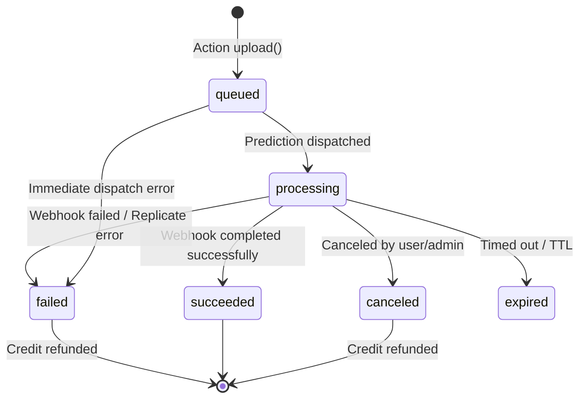

# Extrapolate Database Architecture & Data Model (Phase 1)

This document describes the production database architecture, schema definitions, transactional semantics, state machines, and operational workflows implemented in Phase 1 of the Extrapolate migration.

---

## 1. Executive Summary

Extrapolate's persistence layer has been migrated from a legacy, drifting PostgreSQL/Supabase implementation to an authoritative **SQLite** relational database managed via `@libsql/client`. 

### Key Objectives Achieved
1. **Zero Database Drift**: All application entities (`users`, `generations`, `credit_ledger`, `products`, `prices`, `webhook_events`) are codified in explicit, version-controlled SQLite DDL migrations.
2. **Deterministic Credit Accounting**: Replaced ambiguous single-column updates and race-prone triggers with an append-only, transactional credit ledger enforcing strict non-negative balances.
3. **Finite State Machine**: Modeled generation lifecycles explicitly through validated state transitions (`queued` -> `processing` -> `succeeded` / `failed` / `canceled` / `expired`) with automatic transition timestamps.
4. **Idempotency Everywhere**: Stripe and Replicate webhooks are recorded, deduplicated, and processed inside database transactions to ensure zero double-spending, zero duplicate refunds, and zero phantom credit losses.
5. **Decoupled Architecture**: Tabular application data is completely decoupled from Supabase. Supabase is scoped strictly to stateless OAuth session verification (`@supabase/ssr`) and S3-compatible asset blob storage (`storage-js`).

---

## 2. Technology Selection & Configuration

* **Engine**: SQLite 3 via `@libsql/client`
* **Driver**: Supports pure native and embedded WASM execution with zero C++ compilation toolchain requirements on Windows, Linux, and macOS.
* **Storage Location**: Configurable via `DATABASE_URL` (defaults to `file:./data/extrapolate.db`).
* **Concurrency & Safety Pragmas**:
  - `PRAGMA journal_mode = WAL;` (Write-Ahead Logging for concurrent readers and writer).
  - `PRAGMA busy_timeout = 5000;` (Graceful lock acquisition under contention).
  - `PRAGMA foreign_keys = ON;` (Strict relational integrity).
  - `PRAGMA synchronous = NORMAL;` (Optimal durability/performance tradeoff under WAL).

---

## 3. Schema & Table Definitions

Authoritative migration scripts reside in [`lib/db/migrations/`](../lib/db/migrations/).

### 3.1 `migrations`
Tracks versioned migration execution.
```sql
CREATE TABLE IF NOT EXISTS migrations (
  id INTEGER PRIMARY KEY AUTOINCREMENT,
  name TEXT NOT NULL UNIQUE,
  applied_at TEXT NOT NULL DEFAULT (datetime('now'))
);
```

### 3.2 `users`
Represents application accounts, synchronized from authentication tokens.
```sql
CREATE TABLE IF NOT EXISTS users (
  id TEXT PRIMARY KEY,
  email TEXT NOT NULL UNIQUE,
  full_name TEXT,
  avatar_url TEXT,
  auth_provider TEXT NOT NULL DEFAULT 'supabase',
  auth_provider_id TEXT NOT NULL UNIQUE,
  credits_balance INTEGER NOT NULL DEFAULT 0 CHECK (credits_balance >= 0),
  stripe_customer_id TEXT UNIQUE,
  created_at TEXT NOT NULL DEFAULT (datetime('now')),
  updated_at TEXT NOT NULL DEFAULT (datetime('now')),
  deleted_at TEXT
);
CREATE INDEX IF NOT EXISTS idx_users_auth_provider_id ON users(auth_provider_id);
CREATE INDEX IF NOT EXISTS idx_users_stripe_customer_id ON users(stripe_customer_id);
```

### 3.3 `generations`
Represents an AI age-transformation workflow job.
```sql
CREATE TABLE IF NOT EXISTS generations (
  id TEXT PRIMARY KEY,
  user_id TEXT NOT NULL,
  status TEXT NOT NULL CHECK (status IN ('queued', 'processing', 'succeeded', 'failed', 'canceled', 'expired')),
  input_path TEXT NOT NULL,
  output_path TEXT,
  prediction_id TEXT UNIQUE,
  error_message TEXT,
  credits_cost INTEGER NOT NULL DEFAULT 1 CHECK (credits_cost >= 0),
  created_at TEXT NOT NULL DEFAULT (datetime('now')),
  updated_at TEXT NOT NULL DEFAULT (datetime('now')),
  started_at TEXT,
  completed_at TEXT,
  FOREIGN KEY (user_id) REFERENCES users(id) ON DELETE CASCADE
);
CREATE INDEX IF NOT EXISTS idx_generations_user_id ON generations(user_id);
CREATE INDEX IF NOT EXISTS idx_generations_prediction_id ON generations(prediction_id);
CREATE INDEX IF NOT EXISTS idx_generations_status ON generations(status);
```

### 3.4 `credit_ledger`
Append-only double-entry transaction record backing user credit balances.
```sql
CREATE TABLE IF NOT EXISTS credit_ledger (
  id TEXT PRIMARY KEY,
  user_id TEXT NOT NULL,
  amount INTEGER NOT NULL,
  type TEXT NOT NULL CHECK (type IN ('purchase', 'reservation', 'refund', 'grant', 'adjustment')),
  balance_after INTEGER NOT NULL CHECK (balance_after >= 0),
  generation_id TEXT,
  stripe_event_id TEXT,
  idempotency_key TEXT UNIQUE,
  description TEXT,
  created_at TEXT NOT NULL DEFAULT (datetime('now')),
  FOREIGN KEY (user_id) REFERENCES users(id) ON DELETE RESTRICT,
  FOREIGN KEY (generation_id) REFERENCES generations(id) ON DELETE SET NULL
);
CREATE INDEX IF NOT EXISTS idx_credit_ledger_user_id ON credit_ledger(user_id);
CREATE UNIQUE INDEX IF NOT EXISTS idx_credit_ledger_unique_refund 
  ON credit_ledger(generation_id, type) 
  WHERE type = 'refund' AND generation_id IS NOT NULL;
CREATE UNIQUE INDEX IF NOT EXISTS idx_credit_ledger_unique_purchase
  ON credit_ledger(stripe_event_id)
  WHERE type = 'purchase' AND stripe_event_id IS NOT NULL;
```

### 3.5 `webhook_events`
Audit log and deduplication registry for external provider webhooks.
```sql
CREATE TABLE IF NOT EXISTS webhook_events (
  id TEXT PRIMARY KEY,
  provider TEXT NOT NULL CHECK (provider IN ('stripe', 'replicate')),
  external_event_id TEXT NOT NULL,
  event_type TEXT NOT NULL,
  payload TEXT NOT NULL,
  status TEXT NOT NULL DEFAULT 'received' CHECK (status IN ('received', 'processing', 'processed', 'failed')),
  error_message TEXT,
  received_at TEXT NOT NULL DEFAULT (datetime('now')),
  processed_at TEXT,
  CONSTRAINT uq_webhook_provider_event UNIQUE (provider, external_event_id)
);
CREATE INDEX IF NOT EXISTS idx_webhook_events_provider_external ON webhook_events(provider, external_event_id);
```

### 3.6 `products` and `prices`
Catalog of billing tiers and credit package prices synced from Stripe.
```sql
CREATE TABLE IF NOT EXISTS products (
  id TEXT PRIMARY KEY,
  active INTEGER NOT NULL DEFAULT 1,
  name TEXT NOT NULL,
  description TEXT,
  image TEXT,
  metadata TEXT,
  created_at TEXT NOT NULL DEFAULT (datetime('now')),
  updated_at TEXT NOT NULL DEFAULT (datetime('now'))
);

CREATE TABLE IF NOT EXISTS prices (
  id TEXT PRIMARY KEY,
  product_id TEXT NOT NULL,
  active INTEGER NOT NULL DEFAULT 1,
  unit_amount INTEGER,
  currency TEXT NOT NULL,
  type TEXT NOT NULL DEFAULT 'one_time' CHECK (type IN ('one_time', 'recurring')),
  interval TEXT CHECK (interval IN ('day', 'week', 'month', 'year')),
  interval_count INTEGER,
  trial_period_days INTEGER,
  metadata TEXT,
  created_at TEXT NOT NULL DEFAULT (datetime('now')),
  updated_at TEXT NOT NULL DEFAULT (datetime('now')),
  FOREIGN KEY (product_id) REFERENCES products(id) ON DELETE CASCADE
);
CREATE INDEX IF NOT EXISTS idx_prices_product_id ON prices(product_id);
```

---

## 4. Credit Accounting & Atomicity Guarantees

### 4.1 Ledger Invariant
A user's `credits_balance` in `users` must always reflect the cumulative sum of entries in `credit_ledger` and must **never** be negative (`CHECK (credits_balance >= 0)`).

### 4.2 Reservation Semantics
When an image generation is initiated:
1. `CreditsRepository.reserveCredits(userId, amount, generationId)` executes within an atomic transaction.
2. The user's row is updated with a conditional check:
   ```sql
   UPDATE users
   SET credits_balance = credits_balance - ?
   WHERE id = ? AND credits_balance >= ?;
   ```
3. If zero rows are updated, `InsufficientCreditsError` is raised and the transaction rolls back.
4. An append-only record is inserted into `credit_ledger` with `type = 'reservation'`.
5. Under high concurrency, an automatic retry loop with exponential backoff handles transient SQLite busy locks without violating serializability.

### 4.3 Idempotent Refunds
When a generation fails:
1. `CreditsRepository.refundCredits(userId, amount, generationId, reason)` checks for an existing refund.
2. The partial unique index `idx_credit_ledger_unique_refund` on `(generation_id, type)` guarantees at the database level that a generation cannot be refunded more than once, even if multiple webhook retries arrive simultaneously.

### 4.4 Idempotent Stripe Purchases
When Stripe delivers a `checkout.session.completed` event:
1. The unique index `idx_credit_ledger_unique_purchase` on `stripe_event_id` ensures that credits for a purchase session can only be credited exactly once.

---

## 5. Generation Lifecycle Finite State Machine

Generations transition through strict, validated states:



* **Transition Validation**: Attempting an illegal transition (e.g. `succeeded` -> `failed`) throws `InvalidStateTransitionError`.
* **Automatic Timestamps**: Transitioning to `processing` populates `started_at = datetime('now')`; transitioning to `succeeded`, `failed`, or `canceled` populates `completed_at = datetime('now')`.

---

## 6. Webhook Deduplication & Event Sinks

* `WebhookRepository.recordEvent()` records every incoming webhook payload in `webhook_events`.
* If a duplicate `(provider, external_event_id)` is encountered:
  - The repository catches the unique constraint violation and returns `{ isDuplicate: true }`.
  - The webhook handler returns an immediate `200 OK` without re-executing credit or generation state logic.
* State transitions for webhooks (`received` -> `processing` -> `processed` / `failed`) ensure end-to-end auditability for production debugging.

---

## 7. Migration & Seed Workflows

* **Migration Engine**: `lib/db/migrations/index.ts` executes sequentially sorted `.sql` scripts, tracking executed migrations in the `migrations` table within transactional locks.
* **Running Migrations**:
  ```bash
  pnpm db:migrate
  ```
* **Seeding Default Catalog**:
  ```bash
  pnpm db:seed
  ```

---

## 8. Role of Supabase in Phase 1

1. **Supabase Auth**: Retained for OAuth session cookies (`@supabase/ssr`). When a user signs in, their profile is synchronized to SQLite via `UsersRepository.syncFromAuth()`.
2. **Supabase Storage**: Retained for binary image uploads (`input` and `output` buckets). The database stores relative or public URI paths.
3. **Supabase PostgreSQL / Database**: **Completely replaced by SQLite.** The legacy SQL files in `supabase/` are quarantined and deprecated.
