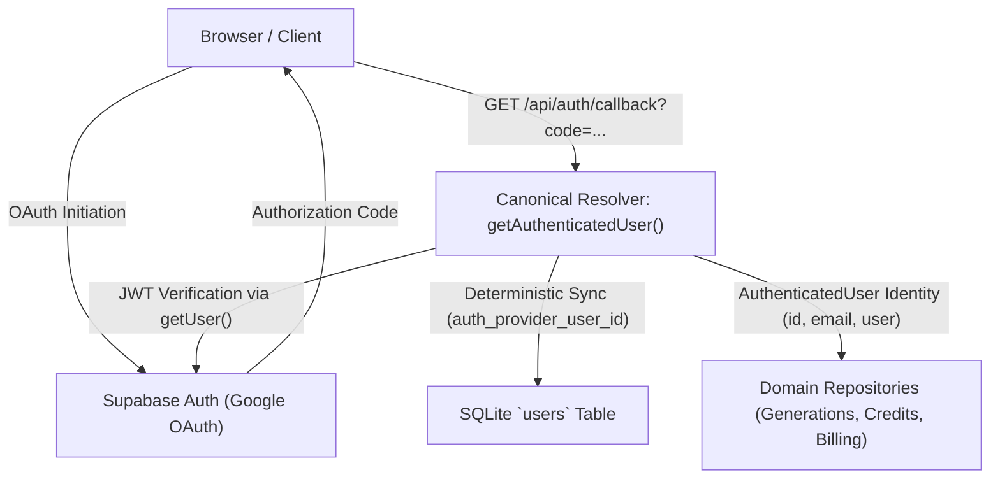

# Extrapolate Security Architecture & Boundaries (Phase 2)

This document details the authentication, authorization, session lifecycle, browser boundaries, and input validation models implemented in Phase 2 of the Extrapolate migration.

---

## 1. Identity & Authentication Architecture

Extrapolate decouples **Identity Verification (OAuth Provider)** from **Application Identity (Persistence Layer)**:

### 1.1 Canonical Resolver (`lib/auth/index.ts`)
The application enforces a single source of truth for authenticated user resolution:
* `getAuthenticatedUser()`:
  1. Reads session cookies via `@supabase/ssr`.
  2. Cryptographically verifies the session token using `supabase.auth.getUser()` (never unverified `getSession()`).
  3. Rejects requests where the token is invalid, expired, or missing.
  4. Resolves or synchronizes the corresponding SQLite user record via `UsersRepository.syncFromAuth()`.
  5. Enforces soft-deletion checks (`deletion_status === 'deleted'`).
  6. Returns a normalized `AuthenticatedUser` object containing:
     - `authProviderUserId`: External OAuth identity (`auth_provider_user_id`).
     - `id`: Authoritative internal SQLite application user ID (`id`).
     - `email`: Verified email.
     - `user`: Complete SQLite user domain entity.
* `requireAuthenticatedUser()`:
  - Wrapper that throws `UnauthorizedError` if no valid, active session exists.

### 1.2 Authentication Authority Rule
> **The authenticated identity comes exclusively from the server-side auth session, never from client-provided user IDs.**
- Clients cannot supply `user_id`, `userId`, or `auth_provider_id` to act on behalf of another user.
- All server actions (`upload`, `checkout`, `billing`, `deleteAccount`) and API routes (`/api/user`) resolve identity via `requireAuthenticatedUser()`.

---

## 2. Resource Ownership & BOLA / IDOR Prevention

Every resource mutation and retrieval enforces strict user ownership before returning data or taking action:

### 2.1 Generation Entity
- **Repository Methods**:
  - `GenerationsRepository.getGenerationForUser(id, userId)`: Scopes query to `WHERE id = ? AND user_id = ?`.
  - `GenerationsRepository.deleteForUser(id, userId)`: Scopes query to `DELETE FROM generations WHERE id = ? AND user_id = ?`.
- **Private Route Protection (`/p/[id]`)**:
  - Requires active user session.
  - Queries `getGenerationForUser(id, currentUser.id)`.
  - If unauthenticated or if the generation belongs to another user, returns a generic `404 Not Found` (`notFound()`).
  - Resource existence is never leaked to unauthorized callers.

### 2.2 Credit Ledger
- `CreditsRepository.listLedgerForUser(userId)` strictly constrains queries to `WHERE user_id = ?`. Regular users cannot query or inspect other users' credit ledger transactions.

### 2.3 Account Deletion
- `deleteAccount` derives the deletion target solely from `requireAuthenticatedUser()`.
- Explicit intent confirmation is enforced: requires `deleteConfirmation === 'delete my account'`.
- Marks user soft-deleted (`deletion_status = 'deleted'`) in SQLite, removes user storage directories, and purges Supabase Auth user record.

---

## 3. Financial Authorization & Credit Tampering Prevention

In previous iterations, the client could pass `credits` along with `price_id` to Stripe checkout creation.

### Phase 2 Hardening:
1. `app/actions/checkout.ts` validates `price_id` format via `validatePriceId(priceId)`.
2. Resolves the price from the SQLite billing catalog using `BillingRepository.getActivePriceWithProduct(priceId)`.
3. Verifies that the product and price are currently active (`active === 1`).
4. Derives the credit amount **authoritatively from product catalog metadata**, completely ignoring any client-submitted `credits` field.
5. Injects the authoritative credit count into Stripe session metadata.

---

## 4. OAuth Callback & Open Redirect Mitigation

### 4.1 Vulnerability Remediation
The original OAuth callback accepted a `next` query parameter and redirected directly to `${origin}${next}`. An attacker could craft an authorization link redirecting to external malicious hosts (e.g. `//evil.com` or `\\evil.com`).

### 4.2 Strict Local Redirect Policy (`lib/auth/redirects.ts`)
`getSafeRedirectPath(next, fallback = "/")` validates redirects against:
* Protocol-relative paths (`//evil.com`, `///evil.com`).
* Windows backslash separators (`\evil.com`, `/\\evil.com`, `%5c`).
* Dangerous URI schemes (`javascript:`, `data:`, `vbscript:`).
* CRLF header injection characters (`\r`, `\n`, `%0d`, `%0a`).
* URL origin escapes via dummy parser verification.
* Any failure defaults safely to `/`.

### 4.3 Missing Auth Error Page
Implemented `app/auth/auth-code-error/page.tsx`:
- Clean, accessible user notification of failed/expired OAuth code.
- Clear retry and home navigation actions.
- Zero leakage of OAuth tokens, authorization codes, or stack traces.

---

## 5. Browser Boundaries, Cookies & Security Headers

### 5.1 Security Headers (`next.config.mjs`)
* **Strict-Transport-Security**: `max-age=63072000; includeSubDomains; preload`
* **X-Content-Type-Options**: `nosniff`
* **X-Frame-Options**: `DENY`
* **Referrer-Policy**: `strict-origin-when-cross-origin`
* **Permissions-Policy**: `camera=(), microphone=(), geolocation=(), browsing-topics=()`
* **Content-Security-Policy**:
  - `default-src 'self'`
  - `script-src 'self' 'unsafe-inline' https://client.crisp.chat https://va.vercel-scripts.com`
  - `style-src 'self' 'unsafe-inline' https://client.crisp.chat`
  - `img-src 'self' data: blob: https://*.supabase.co https://replicate.delivery https://lh3.googleusercontent.com https://avatars.dicebear.com https://client.crisp.chat https://image.crisp.chat`
  - `connect-src 'self' https://*.supabase.co wss://*.supabase.co https://api.stripe.com https://api.replicate.com https://client.crisp.chat wss://client.relay.crisp.chat https://vitals.vercel-insights.com`
  - `frame-src 'self' https://js.stripe.com https://hooks.stripe.com https://accounts.google.com`
  - `form-action 'self' https://checkout.stripe.com https://accounts.google.com`
  - `frame-ancestors 'none'`
  - `base-uri 'self'`
  - `object-src 'none'`

### 5.2 Session Invalidation on Logout
* In `components/layout/user-dropdown.tsx`:
  - Triggers `supabase.auth.signOut()`.
  - Resets Zustand state (`useUserDataStore.getState().setUserData(null)`).
  - Purges SWR cache (`mutate("userData", null, false)`).
  - Forces navigation to `/`, preventing session lingering across multiple accounts on shared browsers.

---

## 6. Input Validation & Mass Assignment Prevention

* **Validation Schemas (`lib/validation/index.ts`)**:
  - `validateGenerationId`: Whitelists `[a-zA-Z0-9_-]{3,64}`.
  - `validatePriceId`: Whitelists `^(price_[a-zA-Z0-9]+|[a-zA-Z0-9_]{5,100})$`.
  - `validateDeleteConfirmation`: Enforces strict case-insensitive match for `"delete my account"`.
  - `validateImageUpload`: Restricts uploads to JPEG, PNG, WebP with a 10MB size boundary.
* **Mass Assignment Protection**:
  - Repositories accept only explicit typed parameter interfaces (`syncFromAuth`, `updateStripeCustomerId`, `markDeleted`).
  - No client-controlled JSON bodies can overwrite internal database columns.
