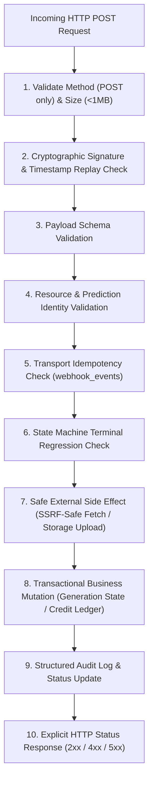

# Extrapolate Webhook Architecture & Idempotent Processing (Phase 3)

This document specifies the cryptographic authentication, replay protection, SSRF mitigation, state machine guarantees, and transactional idempotency implemented for external webhooks in Phase 3.

---

## 1. Webhook Pipeline Architecture

Every external event ingress follows an explicit, multi-stage pipeline:

---

## 2. Replicate Webhook Verification (`lib/security/webhook/replicate.ts`)

Replicate prediction updates deliver signatures using the standard Svix webhook protocol:

* **Signed Content**: `${webhookId}.${webhookTimestamp}.${rawBody}`
* **HMAC Algorithm**: HMAC-SHA256
* **Secret Handling**: Strips `whsec_` prefix if present, decodes the remaining key as base64 bytes. Supports secret rotation via comma-separated string or array of secrets (`REPLICATE_WEBHOOK_SECRET`).
* **Header Parsing**: Handles space-delimited, versioned signature headers (e.g. `v1,sigA v1,sigB v2,sigC`). Only supported `v1` signatures are tested.
* **Constant-Time Verification**: Compares signatures using `crypto.timingSafeEqual` to prevent timing attacks.
* **Replay Protection**: Enforces timestamp checks against configurable tolerance (default 300 seconds / 5 minutes). Timestamps outside this window are rejected with `WebhookReplayError`.

---

## 3. Replicate SSRF & Safe Artifact Fetching (`lib/security/webhook/ssrf.ts`)

When a prediction succeeds, the output artifact URL is downloaded and stored in Supabase Storage. To protect internal networks and cloud infrastructure against Server-Side Request Forgery (SSRF):

1. **Protocol & Port Enforcement**: Strictly requires HTTPS (`protocol === 'https:'`) and standard port 443.
2. **Host Allowlist**: Accepts only `replicate.delivery` and its subdomains (e.g. `pbxt.replicate.delivery`).
3. **Private IP & Metadata Blocking**:
   - Rejects loopback addresses (`127.0.0.1`, `localhost`, `::1`).
   - Rejects link-local and cloud metadata endpoints (`169.254.169.254`).
   - Rejects RFC1918 private IP ranges (`10.0.0.0/8`, `172.16.0.0/12`, `192.168.0.0/16`).
   - Rejects credentials embedded in URLs (`username:password@`).
4. **Redirect-Safe Inspection**: Uses `redirect: 'manual'`. If a 3xx response is encountered, each redirect hop is re-validated against the exact same SSRF allowlist (capped at 3 hops).
5. **Stream Bounding**: Enforces a strict 50MB ceiling (`Content-Length` header check + stream chunk counter). If bytes exceed 50MB, the stream is aborted immediately.
6. **Magic Byte Inspection**: Verifies initial bytes to ensure the artifact is a valid image (`GIF87a`/`GIF89a`, `JPEG`, `PNG`, `WebP`). Malicious HTML, scripts, SVGs, or executables are rejected before storage.

---

## 4. Stripe Webhook Verification (`lib/security/webhook/stripe.ts`)

* **Signature Verification**: Verifies `stripe-signature` against the unparsed raw request body using Stripe's official SDK (`stripe.webhooks.constructEventAsync`).
* **Secret Rotation**: Checks configured `STRIPE_WEBHOOK_SECRET` and fallback/test secrets seamlessly.
* **Event Allowlist**: Strictly handles:
  - `checkout.session.completed`
  - `product.created`, `product.updated`, `product.deleted`
  - `price.created`, `price.updated`, `price.deleted`
  All other event types are acknowledged safely without state mutation.
* **Financial Idempotency**:
  - Credit purchases are keyed to `stripe_event_id` in SQLite `credit_ledger`.
  - The partial unique index `idx_credit_ledger_unique_purchase` on `stripe_event_id` guarantees that repeated delivery of the same checkout event never duplicates credits.

---

## 5. Idempotency & State Invariants

### 5.1 Transport Idempotency
All events are recorded in `webhook_events` with constraint `UNIQUE(provider, external_event_id)`:
- If a delivery arrives with an existing ID, the handler returns `200 OK` with `{ received: true, duplicate: true }`, bypassing business logic.

### 5.2 Business Idempotency & State Machine
- **Terminal State Preservation**: Generations in terminal states (`succeeded`, `failed`, `canceled`, `expired`) ignore out-of-order or delayed webhooks without state regression.
- **Refund Idempotency**:
  - A failed or canceled generation triggers `creditsRepo.refundCredits`.
  - The partial unique index on `(generation_id, type) WHERE type = 'refund'` guarantees that a generation is refunded at most once.
  - Subsequent failure retries return `{ alreadyRefunded: true }` with no balance mutation.

---

## 6. Deprecation of Supabase Customer Webhook

* The route `app/api/webhooks/supabase/customer/route.ts` was an obsolete, unauthenticated PostgreSQL trigger endpoint from before the SQLite migration.
* It has been permanently removed from the application surface.
* A regression test in `tests/webhooks.test.ts` validates that this route no longer exists.
